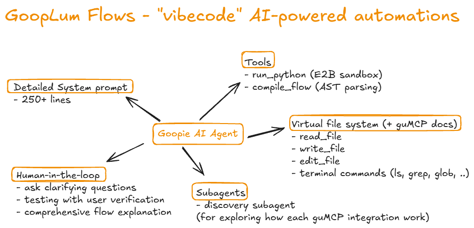
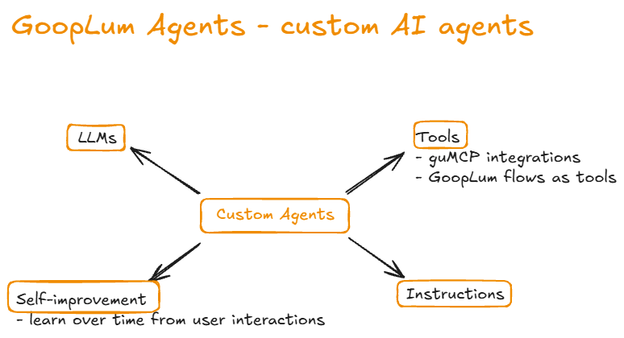

For frontend: go to https://github.com/chatrtham/gooplum-frontend

# ✨ GoopLum
GoopLum is an experimental project inspired by [GumLoop](https://www.gumloop.com/) that explores what's possible with the state of AI in 2025 to lower the barrier to entry for building AI workflows and agents. GoopLum is built on top of [LangGraph](https://github.com/langchain-ai/langgraph), and [E2B](https://e2b.dev/) with 80+ [guMCP](https://www.gumloop.com/mcp) integrations (including Gmail, Slack, CRMs, etc.).

## Core Components

### **Flows**

Automation workflows generated by Goopie AI agent, using emerging agent engineering techniques like HITL, subagents, summarization, and virtual file system access, which allow users to create automations without any programming knowledge

### **Agents**

Custom AI agents that can run flows, interact with external services that guMCP supports, and self-improve themselves over time from user interactions

## 🚀 Quick Start

### Prerequisites
- Python 3.12+
- [UV](https://docs.astral.sh/uv/) for package management
- [Supabase](https://supabase.com/) for database
- [LangSmith API Key](https://smith.langchain.com/) for running server and tracing
- [GumLoop guMCP credentials](https://gumloop.com/gumcp) for integrations (You can get this from https://www.gumloop.com/mcp/gumloop and get the thing between the `
https://mcp.gumloop.com/gumloop/` and `/mcp`)
- [E2B API KEY](https://e2b.dev/dashboard) for sandboxed code execution
- [Anthropic API Key](https://console.anthropic.com/settings/keys)
- [Gemini API Key](https://aistudio.google.com/api-keys)
- [ZAI API Key](https://z.ai/manage-apikey/apikey-list)

### Database Setup

1. **Create a new Supabase project:**
   - Go to [supabase.com](https://supabase.com/)
   - Click "New Project"
   - Choose your organization
   - Set project name (e.g., "gooplum")
   - Set a strong database password
   - Choose your region
   - Click "Create new project"

2. **Set up database tables:**
   - Open your Supabase project dashboard
   - Go to the **SQL Editor**
   - Click "New query"
   - Copy and paste the contents of `database_setup.sql`
   - Click "Run" to execute the setup script

3. **Get your Supabase credentials:**
   - In your Supabase project, go to **Settings** → **API**
   - Copy the **Project URL** and **anon public** key

4. **Configure environment variables:**
   - Create a `.env` file in the backend directory:
   ```bash
   # Supabase Configuration
   SUPABASE_URL=https://your-project-id.supabase.co
   SUPABASE_ANON_KEY=your-anon-key-here
   ```

### Local Setup

```bash
# Install dependencies
uv sync

# Install development dependencies
uv sync --dev
```

### Running the Server

```bash
# Development mode (recommended)
uv run langgraph dev
```

The server will start on `http://localhost:2024`
Once the server is running, you can access the API Docs at `http://localhost:2024/docs`

## 🛠️ Development Commands

```bash
# Code formatting
uv run black .

# Linting and type checking
uv run ruff check .
```

## Limitations
- No triggers based workflows execution
- No subflows (flows calling other flows)
- No parallel execution
- No rate limiting handling
